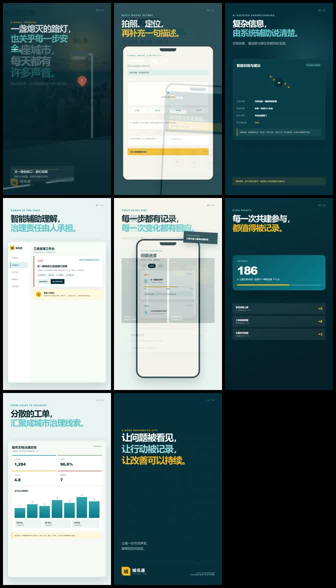
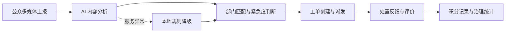

# 城讯通 AI 城市共治平台

面向公众参与的城市治理原型。市民可以通过文字、图片、音频或视频上报问题，系统调用 AI 完成内容理解、部门匹配和紧急度判断，再进入工单处置、反馈与积分激励闭环。

朱磊深度参与后端与 AI 处理链路，包括 FastAPI 接口、SQLAlchemy 数据模型、多媒体上报、AI 服务降级、工单状态流转和前端联调。



[查看 80 秒项目宣传片](promo/output/城讯通-城市共治宣传片.mp4)

## 核心流程



## 📁 目录结构

```
backend/
├── app/
│   ├── api/              # API 路由层
│   │   ├── users.py
│   │   ├── orders.py
│   │   ├── points.py
│   │   ├── departments.py
│   │   ├── admins.py
│   │   └── stats.py
│   ├── core/             # 核心配置
│   │   ├── config.py     # 环境配置
│   │   ├── database.py   # 数据库连接
│   │   ├── security.py   # 密码加密、JWT
│   │   ├── deps.py       # 依赖注入
│   │   ├── exceptions.py # 异常处理
│   │   └── logger.py     # 日志配置
│   ├── models/           # 数据库模型（SQLAlchemy）
│   │   ├── user.py
│   │   ├── order.py
│   │   ├── points.py
│   │   ├── department.py
│   │   └── admin.py
│   ├── schemas/          # 数据校验（Pydantic）
│   │   ├── user.py
│   │   ├── order.py
│   │   └── ...
│   ├── services/         # 业务逻辑层
│   │   ├── ai_service.py
│   │   ├── order_service.py
│   │   ├── points_service.py
│   │   └── user_service.py
│   └── utils/            # 工具函数
│       ├── file.py
│       └── helpers.py
├── tests/                # 测试
├── uploads/              # 文件上传目录
├── logs/                 # 日志目录
├── .env                  # 环境变量（不提交到git）
├── .env.example          # 环境变量示例
├── main.py               # 启动入口
├── requirements.txt      # 依赖
└── README.md
```

## 🚀 快速启动

### 1. 安装依赖
```bash
pip install -r requirements.txt
```

### 2. 创建MySQL数据库
```sql
CREATE DATABASE chengxuntong CHARACTER SET utf8mb4 COLLATE utf8mb4_unicode_ci;
```

### 3. 配置环境变量
```bash
cp .env.example .env
# 编辑 .env 填入实际配置
```

### 4. 初始化数据库（自动建表+种子数据）
```bash
python -m app.core.init_db
```

### 5. 启动服务
```bash
# 开发环境
uvicorn main:app --reload --host 0.0.0.0 --port 9000

# 生产环境（推荐）
gunicorn main:app -w 4 -k uvicorn.workers.UvicornWorker --bind 0.0.0.0:9000
```

### 6. 访问文档
- Swagger UI: http://localhost:9000/docs
- ReDoc:      http://localhost:9000/redoc

### 7. 访问 Web 前端

后端启动后，无需另开静态文件服务：

- 官网首页：http://localhost:9000/web
- 市民端/管理端工作台：http://localhost:9000/index.html

工作台已经连接真实 API：

- 市民端支持注册、登录、问题上报、工单查询、结案评价和积分明细。
- 管理端支持登录、统计总览、工单列表、状态更新和处理结果填写。
- 官网上报抽屉会复用市民登录态；未登录时自动保存草稿并跳转到工作台登录。

开发环境默认启用 `AI_FALLBACK_ENABLED=True`。外部 AI 服务不可用时，系统会使用本地规则完成基础分类，保证前后端联调链路可用；生产环境建议关闭降级并配置正式 AI 服务。

## 🔐 认证

使用 JWT Token 认证。登录后获取 token，请求时在 Header 中携带：
```
Authorization: Bearer <token>
```

## 📝 主要技术栈

- **FastAPI** - Web框架
- **SQLAlchemy** - ORM
- **Pydantic v2** - 数据校验
- **PyMySQL** - MySQL驱动
- **JWT (PyJWT)** - 身份认证
- **bcrypt** - 密码加密
- **loguru** - 日志
